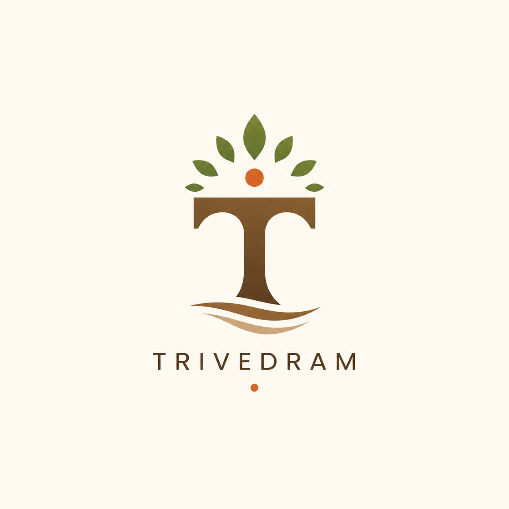

<div align="center">



#  TRIVEDRAM

### *Rooted in India 🌿 • Building for the World 🌍*


<br>


<br><br>

> **"Learn. Build. Share. Repeat."**

<br>


</div>


# 👋 About

**Trivedram** is an open-source organization of students who are passionate about building useful software, exploring emerging technologies, and learning together.

We're rooted in India, collaborate globally, and believe the best software is built through curiosity, openness, and community.

Whether you're here to contribute, learn, or simply explore—

**Welcome! ❤️**


<table>
<tr>

<td width="50%" valign="top">

## 🚀 What We Do

<table>
<tr><td>🤖</td><td><b>Artificial Intelligence</b></td></tr>
<tr><td>☁️</td><td><b>Cloud & Infrastructure</b></td></tr>
<tr><td>🌐</td><td><b>Web Development</b></td></tr>
<tr><td>📱</td><td><b>Mobile Applications</b></td></tr>
<tr><td>🛠</td><td><b>Developer Tools</b></td></tr>
<tr><td>🔬</td><td><b>Research</b></td></tr>
<tr><td>📚</td><td><b>Learning Resources</b></td></tr>
<tr><td>❤️</td><td><b>Open Source</b></td></tr>
</table>

</td>

<td width="50%" valign="top">

## 🌱 Our Values

✅ Stay Curious

🤝 Build Together

📚 Keep Learning

❤️ Respect Everyone

✨ Improve Continuously

🌍 Share Knowledge

<br>

<p align="center">
<b><i>Curiosity creates.<br>Consistency wins.</i></b>
</p>

</td>

</tr>

<tr>

<td width="50%" valign="top">

## ❤️ Open Source

> Great software grows through collaboration.

✔ Share knowledge

✔ Help developers learn

✔ Build in public

✔ Review code

✔ Learn together

✔ Give back to the community

</td>

<td width="50%" valign="top">

## 🤝 Contributing

```
🍴 Fork
   │
🌱 Branch
   │
💻 Build
   │
🚀 Pull Request
   │
🎉 Merge
```

**Every contribution matters.**

Whether it's code, documentation, ideas, or design—
you're welcome here.

</td>

</tr>
</table>

<div align="center">

**Every expert was once a beginner.**

We welcome developers of all experience levels.

</div>

---

   
# ⭐ Join the Journey

If you like what we're building, you can support us by:

 -⭐ Starring our repositories
 -🐛 Reporting issues
 -💬 Starting discussions
 -🚀 Opening Pull Requests
 -📖 Improving documentation
 -💡 Sharing ideas

Every contribution helps this community grow.

<div align="center">


<br><br>

━━━━━━━━━━━━━━━━━━━━━━━━━━━━━━

### 🌿 Rooted in India

### 🌍 Built for Everyone

### ❤️ Open by Default

━━━━━━━━━━━━━━━━━━━━━━━━━━━━━━

<br>

> *"The best software isn't just written.*
>
> *It's shared, improved, and built together."*

<br>

### **Keep Building • Keep Learning • Keep Sharing**

<br>


### ❤️ See you in the next commit.

</div>

